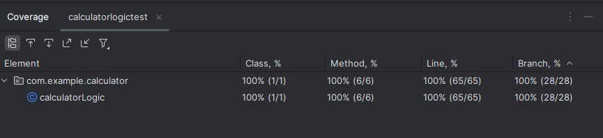

# KSU SWE 3643 Software Testing and Quality Assurance Semester Project: Web-Based Calculator

You will find a web-based calculator that performs calculation such has mean, standard deviations and linear regressions.
It includes back and frontend logic with unit tests, a user interface, end-to-end playwright testing and documentation and videos
to guide usage and testing.

## Table of Contents

-[Team Members](#team-members) 

-[Architecture](#architecture) 

-[Environment](#environment) 

-[Executing the Web Application](#executing-the-web-application) 

-[Executing Unit Tests](#executing-unit-tests) 

-[Reviewing Unit Test Coverage](#reviewing-unit-test-coverage) 

-[Executing End-To-End Tests](#executing-end-to-end-tests) 

-[Final Video Presentation](#final-video-presentation-) 

## Team Members

Rafay Hassan

## Architecture

The diagram below outlines the architecture of the Web-Based Calculator that incorporates unit testings and end-to-end
testing frameworks that are structured as follows:
 
-Calculator End-to-End Tests (Playwright) 
-Calculator Logic Unit Tests (JUnit) 
-Calculator Logic Package 
-Calculator Web Server App 
-Browser Integration  

## Environment

To prepare your environment to execute this application: 
1. Install Java (version 21+) for your system: https://www.oracle.com/java/technologies/downloads/
  
To check if you have java installed onto your machine, run this command on the command terminal:
  

  
2. Install Apache Maven for your system: https://maven.apache.org/download.cgi
  
To check if you have Maven installed onto your machine, run this command on the command terminal:
  

## Executing the Web Application

## Executing Unit Tests

## Reviewing Unit Test Coverage

## Executing End-To-End Tests

## Final Video Presentation 